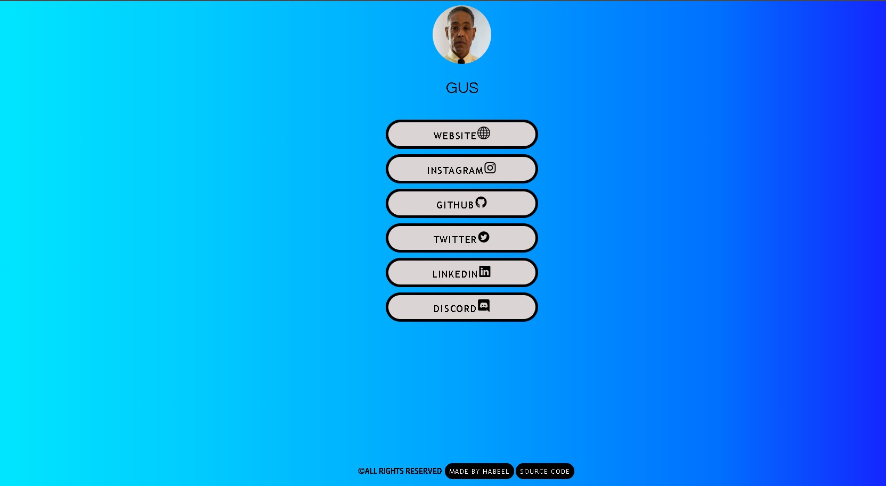
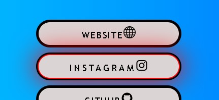

## 📝About
A simple webpage which includes links to your various social media platforms. <br>
Useful of instagram.<br>
[CLICK HERE TO SEE DEMO](https://demo-social-media-link-page.vercel.app/)
## 🖼️ Image



## 🛠️ Extra Customizations


1️⃣ If you want to change the background gradient just make your own gradient [here](https://mycolor.space/) and paste it in ```style.css ```.
<br>

2️⃣ For Animated backgrounds I have kept few animations( ```vanta.js``` ) in the ```js``` folder.<br>
Keep on one thing in mind that there are animations only there.You have to add the required code yourself and you can find it [here](https://www.vantajs.com/).
